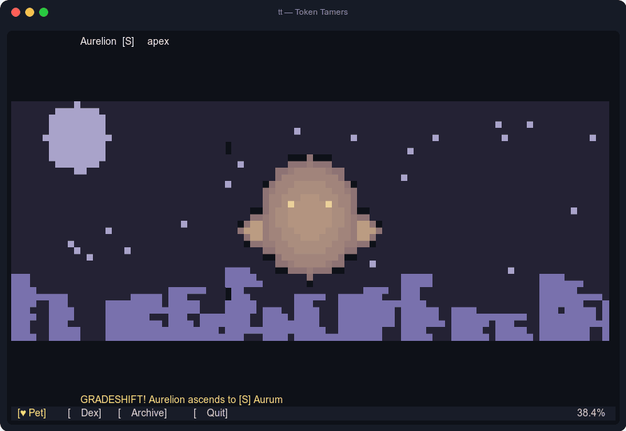

<div align="center">

# 🐲 Token Tamers

### Your work raises a monster. _Literally._ Whatever agent you use.

A fully idle, fully offline **terminal virtual pet** for developers — raised passively by
your real AI coding-agent usage. No clicks. No chores. No API calls. **You ship code; your
monster evolves.**

[](https://github.com/zivkong/token-tamers/releases/latest)
[](LICENSE)
[](#-install--update)
[](#-the-three-pledges)

</div>

<p align="center">
  
</p>

<div align="center">

_Real footage — the actual renderer drew every frame of that GIF._
**Half-block pixel-art sprites · clickable 4:3 canvas · 30 fps on &lt;2% CPU · works over SSH**

`tt status` → `🥚 Wisp [B]● molt 4 ▓▓░░` — yes, it fits in your statusline.

</div>

---

## ▶️ Press Start

Two lines and you're playing. No Node, no sudo, no signup.

```sh
# 1. Install (macOS & Linux — verifies SHA256, drops `tt` in ~/.local/bin)
curl -fsSL https://github.com/zivkong/token-tamers/releases/latest/download/install.sh | sh

# 2. Hatch
tt init     # one-time wizard: finds your agents, learns YOUR baseline
tt          # open the shell, meet your egg 🥚  (q to quit)
```

That's it. `tt init` is the **only required interaction, ever** — after that, your job _is_
the game. Keep coding; your egg hatches ~10 minutes after your first session closes.

> 🪟 **On Windows, or want the portable build?** See **[Install &amp; update](#-install--update)**
> for PowerShell, the single-file `tt.js`, and how to update / uninstall.

---

## 🤝 The three pledges

Trust is the whole game. Each pledge is **mechanically enforced in CI** — not just promised,
but proven on every commit:

|     | Pledge                                  | What it means                                                                                                                                                                                                                                                                                               |
| --- | --------------------------------------- | ----------------------------------------------------------------------------------------------------------------------------------------------------------------------------------------------------------------------------------------------------------------------------------------------------------- |
| 🔒  | **Read-only. Never spends your tokens** | Token Tamers never calls an AI API and never touches your quota. It only _reads_ the usage logs your agent already writes to disk. Your pet grows because you shipped real work.                                                                                                                            |
| 🔌  | **Fully offline by default**            | No telemetry, no sync, ever. The game makes zero network connections; the sole exception is the **opt-in, off-by-default** updater (`tt update` — fetches verified releases from GitHub, sends nothing). CI confines _all_ network code to one audited file. Social features are humans pasting text codes. |
| ⚖️  | **No model judgment**                   | Model choice shapes your pet's _species and looks_ — never its stats, grades, or speed. Progress normalizes to **your own baseline**: a small-model dev and a frontier-model dev raise equally strong pets.                                                                                                 |

---

## 🎮 How to play (the manual)

You don't "play" Token Tamers so much as **live next to it**. The core loop is dead simple —
then every section below is an optional rabbit hole. Pop them open when you're curious.

```text
 you ship code ──▶ tokens & sessions ──▶ 🥚 essence
      ▲                                      │
      │            🥚 egg fast-hatches ~10 min after first usage
      │            🐣 every 5-hour window close = a MOLT
      │            …the moment your pet evolves, rolls a trait,
      │            mutates, or grades up
      │                                      │
      └── new egg ◀── REBIRTH (weekly) ◀─────┘
            lineage carries 30–70% forward, forever
```

<details>
<summary><strong>🐣 Molts &amp; Rebirth — the heartbeat</strong></summary>

<br>

Two clocks drive everything:

- **Molt** = the close of a **5-hour session window**. This is the big moment — your pet may
  evolve a stage, roll a new trait, mutate, or grade up. Eggs skip the wait and **fast-hatch
  ~10 minutes** after your first usage.
- **Rebirth** = the **weekly boundary**. Your current pet retires into the **Archive**, and a
  fresh egg takes its place. Rebirth _never_ evolves — it's a new generation, carrying
  **30–70% of the bloodline's stats forward** (deeper lineage → more carry-over).

Stop coding for a week? Your pet curls into a cocoon — **Dormant, never dead** — and wakes the
moment you return. Generation 14 will be waiting.

Stages climb at a deliberate ~5-day pace, not one-per-molt:
**egg → sprite → rookie → evolved → prime → apex.** The path branches on _how_ you work, and
the next form is always a surprise — the game never spoils your evolution.

</details>

<details>
<summary><strong>🏛️ Houses &amp; Species — your model mix becomes identity</strong></summary>

<br>

Every House blends models from several makers by **vibe, not brand** — and each is a full
**creature kingdom** with its own body plan:

| House      | Kingdom                        | Fed by                            |
| ---------- | ------------------------------ | --------------------------------- |
| **Aether** | ethereal flyers ☁️             | `claude-*`, `minimax*`            |
| **Cipher** | glyph-armored ground beasts 🗿 | `gpt-*` / `o*`, `glm*`, `mimo*`   |
| **Flux**   | swift water-runners 🌊         | `gemini-*`, `qwen*`, `kimi*`      |
| **Forge**  | ember-cored robots ⚙️          | `llama*`, `mistral*`, `deepseek*` |
| **Wild**   | feral plant-beasts 🌱          | anything unmapped (The Bloom)     |

**Identity only.** No House is stronger. No model is "better food." Mixing agents diversifies
your pet's _diet_ and unlocks **hybrid species** 🧪 — it never inflates raw power.

</details>

<details>
<summary><strong>🎲 Grades — a slow, honest thrill (C → B → A → S)</strong></summary>

<br>

Every molt rolls for a grade-up with **published odds**. Grades **never go down**, there's
**no pity timer**, and the UI **always shows your exact odds** for the next jump.

| Roll  | Base odds | Cap        |
| ----- | --------- | ---------- |
| C → B | 25%       | —          |
| B → A | 10%       | —          |
| A → S | 3%        | ~6% (hard) |

Odds are **activity-modified** against your own baseline (model- and volume-blind). A heavy
session adds a small, **capped Food bonus** to that molt's roll (full at 200M tokens) — push
more before a window closes and watch the on-screen **Food** meter fill.

And the higher the grade, the more _gorgeous_ the sprite:

| ○ C · Slate            | ● B · Verdant    | ◆ A · Violet                       | ★ S · Aurum                                       |
| ---------------------- | ---------------- | ---------------------------------- | ------------------------------------------------- |
| flat 4-color, charming | 8 colors, blinks | 16 colors, dithered shading, glint | full 24-bit ramps, shimmer sweep, particle aura ✦ |

When **S** lands, your palette upgrades **live**. People screenshot it. That's the point.

</details>

<details>
<summary><strong>🧬 Traits — your rhythm becomes your pet</strong></summary>

<br>

_How_ you code shapes _who_ your pet becomes. Nine traits, plus four hidden pattern forms:

- 🌙 Code after midnight → **Nightshade**
- 🏃 Ride a session window to its cap → **Marathoner**
- 🐝 Juggle many short sessions → a **Swarm** emerges

No two devs raise the same creature. Your habits _are_ the gameplay.

</details>

<details>
<summary><strong>⚔️ Battles — settle it by DNA code</strong></summary>

<br>

Every pet can be exported as a shareable **DNA code** — and battles are **deterministic**:
same two codes, same outcome, every time, fully offline.

- Open the **Battle** page, then paste a **friend's code** or pick one of your own Dex records — or run `tt battle [code]`.
- Fight your own records, or paste a friend's code to throw down across machines.
- The ruleset is a **House type-wheel** with **trait procs** — pure strategy, zero RNG-fishing.
- A pet must be at least **Evolved** to step in the ring.

Social play is just humans swapping text. No servers, no accounts, no network.

</details>

<details>
<summary><strong>🏆 Completion &amp; Seasons — the North Star</strong></summary>

<br>

**The goal: 100% completion.** One number to drive to 100 — check it any time with
`tt complete`. It blends:

- 📖 the **Dex** (56 species this Season)
- 🏅 every **achievement**
- 🏞️ every **habitat**
- 💎 every **trinket**

Content lands in **Seasons**, and each Season ships its _own_ obtainable roster — so **100%
is always reachable now**; the bar simply rises when the next Season drops.

- ✅ **Season 0 — Genesis** _(you're here)_: five founding House lines, 56 species, and
  **deterministic battles** — growing to add the full **collect-and-decorate** loop.
- 🔜 **Season 1 — Crossbreed**: all about **DNA** — export and graft codes with friends to
  fuse hybrid lines, fusion pools, and cross-provider **Chimera** forms 🤫.

</details>

---

## 🕹️ Commands

The shell (`tt` with no args) is home base — Pet, Dex, Archive, and Settings, all clickable.
Everything also has a one-shot command for your scripts and statusline:

| Command       | What it does                                           |
| ------------- | ------------------------------------------------------ |
| `tt`          | The clickable shell: Pet, Dex, Archive, Settings pages |
| `tt watch`    | Slim live view                                         |
| `tt status`   | One-line status — drop it in your prompt / statusline  |
| `tt dex`      | Collection progress, "???" silhouettes included        |
| `tt archive`  | Hall of Fame: your best record per species             |
| `tt battle`   | Battle a pet vs an Archive record or a pasted DNA code |
| `tt complete` | The completion meter, your % toward 100                |
| `tt adapters` | Adapter health, paths, warnings                        |

Everything honors `--no-color` and degrades gracefully: **truecolor → 256 → 8 → ASCII**.

---

## 🔌 Supported agents

Token Tamers reads the session logs your agent **already writes** — locally, read-only:

| Agent       | Status  | Reads (locally, read-only)                      |
| ----------- | ------- | ----------------------------------------------- |
| Claude Code | ✅ now  | `~/{.config/claude,.claude}/projects/*/*.jsonl` |
| OpenCode    | ✅ now  | `~/.local/share/opencode/`                      |
| Codex CLI   | 🔜 next | `$CODEX_HOME/sessions/**/rollout-*.jsonl`       |

Adapters emit **one** normalized event stream; the engine never knows which agent fed it.
Multiple agents feed **one pet** — a second agent diversifies its diet, never inflates its
power. Cross-agent diets unlock hybrid species. 🧪

---

## 📦 Install &amp; update

**macOS & Linux** — one line, no Node, no sudo. Detects your platform, verifies the download
against `SHA256SUMS.txt`, and installs `tt` to `~/.local/bin`:

```sh
curl -fsSL https://github.com/zivkong/token-tamers/releases/latest/download/install.sh | sh
```

**To update**, re-run that exact line — it replaces `tt` in place with the latest release
(`tt --version` shows what you're on). **To uninstall**, swap `install` → `uninstall`:

```sh
curl -fsSL https://github.com/zivkong/token-tamers/releases/latest/download/uninstall.sh | sh
```

Token Tamers is just one binary plus the `~/.tokentamers/` folder — and that folder
**survives every update, reinstall, and uninstall**, because DNA and hashes parse across all
versions. **You never lose a generation.** To erase your pet too, uninstall with `TT_PURGE=1`.

<details>
<summary><strong>⚙️ Tune the install with env vars</strong></summary>

<br>

| Variable         | Default        | What it does                                       |
| ---------------- | -------------- | -------------------------------------------------- |
| `TT_VERSION`     | `latest`       | install or pin a specific tag, e.g. `v1.2.0`       |
| `TT_INSTALL_DIR` | `~/.local/bin` | where `tt` is installed into / removed from        |
| `TT_PURGE`       | `0`            | set `1` so uninstall also deletes `~/.tokentamers` |

Cautious about piping to `sh`? Download the script, read it, then run it — e.g.
`curl -fsSL …/install.sh -o install.sh && sh install.sh`. Every asset is signed: verify
provenance with `gh attestation verify <file> --repo zivkong/token-tamers`.

</details>

<details>
<summary><strong>🪟 Windows (PowerShell)</strong></summary>

<br>

```powershell
Invoke-WebRequest -Uri https://github.com/zivkong/token-tamers/releases/latest/download/tt-windows-x64.exe -OutFile "$env:LOCALAPPDATA\tt.exe"
# then add %LOCALAPPDATA% to your PATH, or move tt.exe somewhere already on it
```

</details>

<details>
<summary><strong>⬢ Node ≥ 20 (any OS) / portable single file</strong></summary>

<br>

```sh
# portable single file, zero dependencies
curl -fsSL -o tt.js https://github.com/zivkong/token-tamers/releases/latest/download/tt.js
node tt.js --version
```

Want to build it from source or hack on it? That's a contributor flow — head to
**[CONTRIBUTING.md](CONTRIBUTING.md)**.

</details>

---

## ❓ FAQ

<details>
<summary><strong>Does this spend my tokens or API credits?</strong></summary>

<br>

No. Never. It reads log files your agent already wrote. There is no network-capable code in
this repository — ESLint bans the imports and CI greps every PR.

</details>

<details>
<summary><strong>Is my data sent anywhere?</strong></summary>

<br>

No. Everything lives in `~/.tokentamers/` on your machine. The "shared world" (weekly weather,
future Drifter DNA) is derived deterministically from the calendar, so every offline machine
agrees without ever talking.

</details>

<details>
<summary><strong>I only use small / local models — is my pet weaker?</strong></summary>

<br>

No. Progression normalizes to <em>your own</em> baseline; model mix only flavors species
identity. This is pledge #3 of the design, and tests enforce it.

</details>

<details>
<summary><strong>What's with the S-grade obsession?</strong></summary>

<br>

A→S is a ~3–6% roll, once per molt, never guaranteed, never lost. When it lands, your pet's
palette upgrades <em>live</em> — gold ramps, shimmer sweep, particle aura. People screenshot
it. That's the point.

</details>

<details>
<summary><strong>How does my pet stay in sync with my usage?</strong></summary>

<br>

Automatically — just run <code>tt</code>. Every launch rescans the agents you enabled, folds in
your new usage, and advances your pet to now. Your molt windows and weekly rebirth follow your
real activity on their own. Want the weekly cycle pinned to the <em>exact</em> minute your
subscription resets? That instant only appears on Claude Code's statusline, so make <code>tt</code>
your statusline — add <code>"statusLine": { "type": "command", "command": "tt statusline" }</code> to
<code>~/.claude/settings.json</code>. It's optional and read-only; the default inferred cycle is
perfectly playable. Full guide (including how to keep another statusline alongside it):
<a href="docs/wiki/getting-started.md#syncing-your-cycle">Syncing your cycle</a>.

</details>

<details>
<summary><strong>I want to know everything. Where are the deep docs?</strong></summary>

<br>

Full player wiki: [`docs/wiki/`](docs/wiki/) —
[Houses](docs/wiki/houses.md) · [Species](docs/wiki/species.md) ·
[Battles](docs/wiki/battles.md) · [Achievements](docs/wiki/achievements.md) ·
[Trinkets](docs/wiki/trinkets.md) · [Unlockables](docs/wiki/unlockables.md).
The full design reference lives under [`docs/design/`](docs/design/).

</details>

---

## 🗺️ Roadmap

- [x] **Season 0 — Genesis · shipped:** Claude Code + OpenCode adapters · evolution engine
      (all five house lines — Aether · Cipher · Flux · Forge · Wild, egg → Apex, 56 species) ·
      traits, patterns, mutations · grade rolls · rebirth + lineage · the Archive · clickable
      TUI · 12 habitats, 6 trinkets, 44 achievements · shareable DNA codes · deterministic
      **battles** (the Battle page: paste a code or pick a Dex record, or `tt battle`; House type wheel, trait procs)
- [ ] **Season 0 — Genesis · building:** the **collect-and-decorate** loop (`tt deco`, equip
      habitats & trinkets)
- [ ] **Season 1 — Crossbreed:** **DNA export/apply** (paste codes to friends) · DNA
      **grafting** · hybrid lines (Aether×Flux, Forge×Cipher) · fusion pools 🤫 · cross-provider
      Chimera forms
- [ ] **Season 2 — Coliseum:** Team Leagues + standings · Drifter DNA for solo devs · Codex CLI adapter
- [ ] **Season 3 — Tempest:** monthly weather events · the full collection (more achievements,
      habitats & trinkets)
- [ ] **Ongoing:** hand-crafted sprite art · the sprite compiler pipeline · more adapters

<sub>Season 2/3 names are provisional. Full plan: [`docs/design/roadmap-retention-backlog.md`](docs/design/roadmap-retention-backlog.md).</sub>

---

## 🛠️ Want to contribute?

Token Tamers is **AI-native open source**: built entirely with AI coding agents, kept honest
by mechanical gates. Humans own architecture; CI owns quality; AI writes the code. Whether you
bring a creature concept, a sprite, an adapter, or a bug fix — **[CONTRIBUTING.md](CONTRIBUTING.md)**
walks you from `git clone` to your first PR. Your agent will feel right at home.

<div align="center">

**[MIT](LICENSE)** © 2026 Ziv Kong

⭐ Star the repo — then go write some code. Your egg is counting on you. 🥚

</div>
